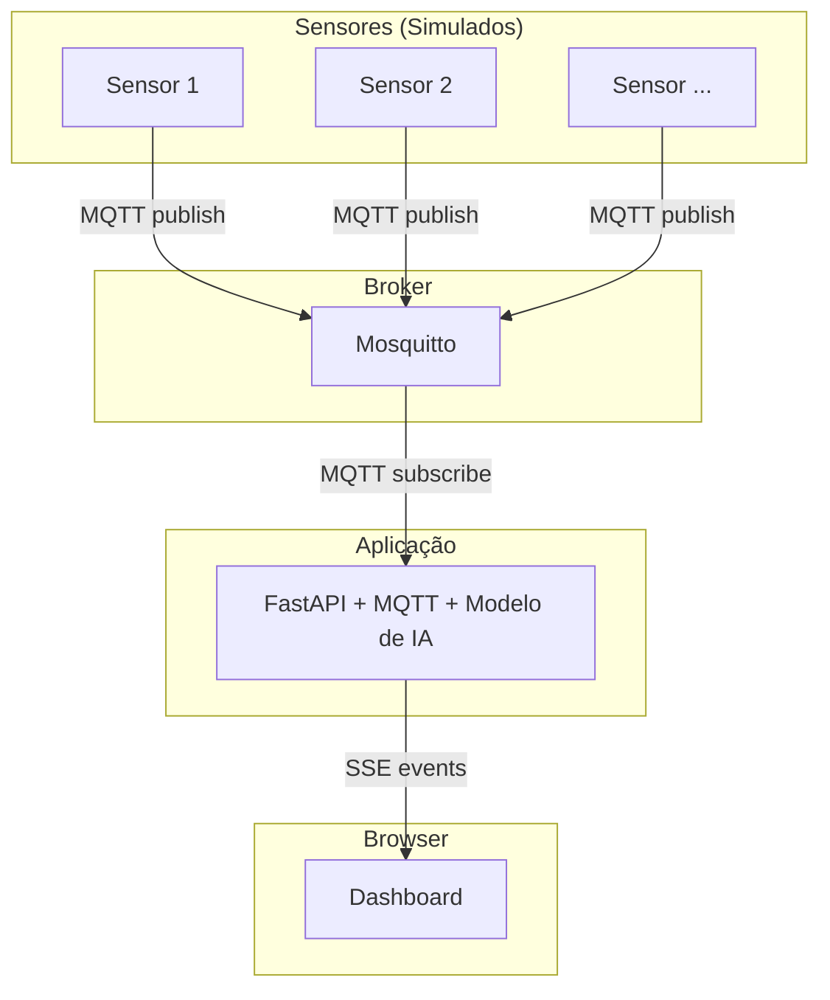

# Sistema de Monitoramento de Estacionamento Inteligente Baseado em IoT e Machine Learning

Projeto desenvolvido para a disciplina Internet das Coisas e Aplicações de IA do Curso de Especialização em Inteligência Artificial Aplicada – Unisinos.

Este sistema implementa um estacionamento inteligente completo, integrando sensores (simulados), comunicação via MQTT, processamento com Inteligência Artificial e visualização em tempo real por meio de um dashboard web.

## Autores
- [Augusto Stahlschmidt](https://github.com/augustostahlschmidt)
- [Eduardo Moraes](https://github.com/edudu01)

## Descrição Geral

O projeto simula um ambiente IoT em que sensores ultrassônicos monitoram vagas de estacionamento e enviam leituras para um broker MQTT. Uma aplicação backend em FastAPI recebe essas leituras, processa os dados, utiliza um modelo de Machine Learning para prever se a vaga está ocupada ou não, e retransmite o estado atualizado para um dashboard via Server-Sent Events.

A solução demonstra um pipeline completo de IoT + IA, cobrindo coleta, transporte, processamento e visualização de dados em tempo real.

## Arquitetura do Sistema


## Modelo de Inteligência Artificial

O notebook contendo o passo-a-passo do treinamento, validação, teste e exportação do modelo de inteligência artificial pode ser encontrado em [ model_training_and_extraction.ipynb](https://github.com/augustostahlschmidt/parking-spot-dashboard/blob/main/model_training_and_extraction.ipynb).

## Como Executar o Sistema

1. Instalar dependências
```bash
pip install -r requirements.txt
```

2. Instalar o Mosquitto (opção 1)
Windows:
Baixe em: https://mosquitto.org/download
Após instalar, garanta que mosquitto.exe esteja no PATH.

3. Executar o sistema completo

O repositório inclui um script que automatiza toda a execução: `run_mqtt.py`.
Ele realiza o seguinte fluxo:
1. Tenta iniciar o Mosquitto instalado localmente
2. Caso não encontre, tenta iniciar via Docker
3. Inicializa o backend FastAPI (Uvicorn)
4. Abre o dashboard no navegador (http://localhost:8000)
5. Abre uma nova janela rodando o simulador de sensores MQTT
6. Exibe os logs do servidor no terminal

A documentação da API está disponível em: http://localhost:8000/docs

## Licença

Projeto destinado a fins acadêmicos.